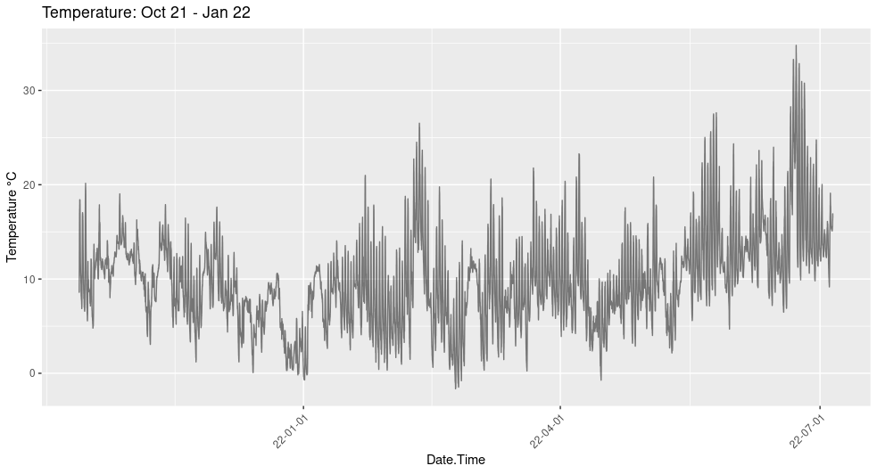
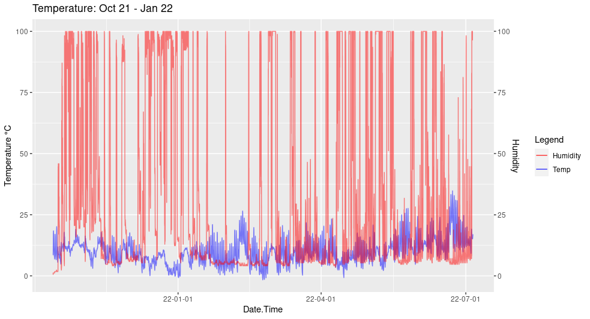
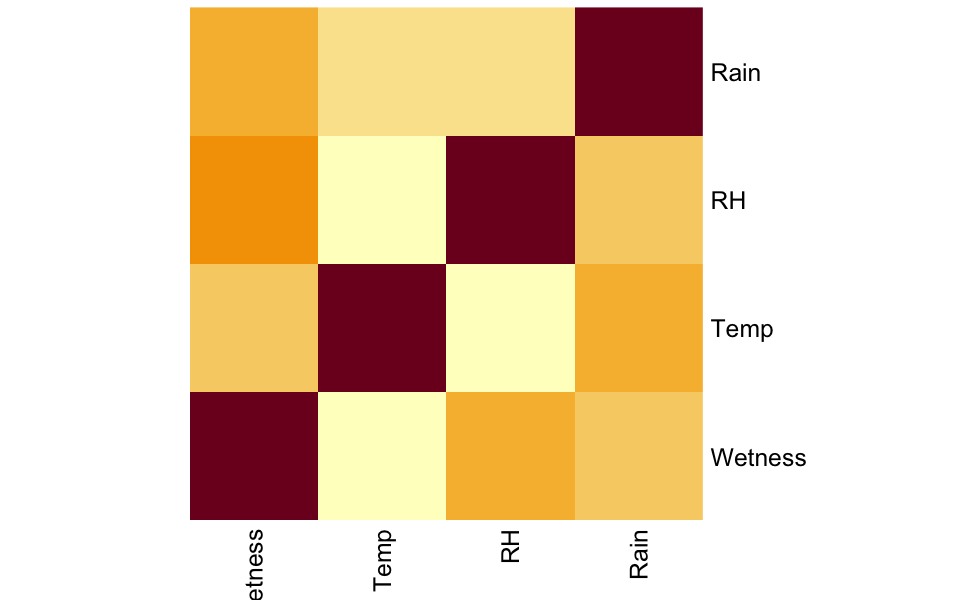

# Welcome
 
`HoboR` is a package for the analysis of weather station data. Analyzing weather station data can quickly become a big data project, making the task of processing and analysing data a significant challenge. To facilitate analysis and manipulation of weather station data, we developed `HoboR`. `HoboR` aims to simplify this process, making it less time-consuming for researchers and users of weather data. `HoboR` offers a series of tools to load multiple CSV files, remove duplicates, process and summarize data.

`HoboR` is a specialized R package designed to streamline the processing of large datasets from HOBO weather stations and data loggers. With `HoboR`, handling .csv files generated by a variety of [HOBO](https://www.onsetcomp.com) models or other weather station data becomes effortless. This package analyzes any microclimate measurements such as temperature, relative humidity (RH), dew point, and radiation. Additionally, `HoboR` is versatile in accepting data in multiple date formats, including *Day/Month/Year* (DD/MM/YYYY), *Month/Day/Year* (MM/DD/YYYY), and two digits *Year/Month/Day* (YY/MM/DD), ensuring flexibility across global time formats.

## Other Tutorials and Documentataion

### [HOBOR components]({{ site.baseurl }}) 

### [HOBOR Callibration]({{ site.baseurl }}) 

### [An example to implement weather data]({{ site.baseurl }})

#### Manuscript--> HOBOR: An R package for weather data manipulation


## **How to Install HOBOR**

`HOBOR` installation via `devtools`, and in the process of submit it to CRAN. 

First, install `devtools` and dependency libraries
```R
install.packages("devtools")
library("devtools")
 devtools::install_github("LeBoldus-Lab/hoboR", force = TRUE)
library(hoboR)
```
Recommended dependencies

```R
library(lubridate)
library(tidyr)
library(dplyr)
library(reshape2)
library(ggplot2)
library(scales)
```

## **How to use HOBO**

### **For readers**
Hobor is an R package to process CSV files from HOBO weather stations and data loggers. The best way to start your project with hobor, is to organize your CSV files from a single directory for `hobobinder()` function to process all the CSV files. E.g., if you have 10 locations, you should have 10 folders, and each folder containing all the CSV. Grouping the data files in a single location creates a single file with all the weather records, including duplicates that hobocleaner() can identify and sort out. Most duplicates can be generated by retrieving data or replacing batteries. You can summarize by time the sensors of your device, like temperture, relative humidity (men and standard deviation) and (mins and max) for precipitation records using meanhobo(). 

The HOBO sensors might fail due to environment and other related issues. To identify such malfunctionality, a series of functions to `identifyimpossible()` values and `sensorfailures()` are available.. Additional functionality for subsetting by time intervals using `hoborange()`, and snapshots of time intervals using `timestamp()`. A calibration guide for HOBO data loggers for microclimate experiments can be accessed and evaluated with `calibrator()` and `correction()` to adjust to a baseline all the HOBO loggers. An experimental design for disease incidence measuring environmental variables and the sudden oak death (SOD) epidemic in Southern Oregon.

### **For coders**

```R
# load the library
library(hoboR)
```

## **Example:**
Suppose you have multiple CSV files in a directory called site A. 

```R
# Change the number for the site
site = "A"
# Add the PATH to your sites for weather data (from hobo)
path = paste0("path/your//site_", site)
# make sure the path to your CSV files exists
file.exists(path)        # this will return a logical value TRUE
```

All the CSV from site A are merged with `hobinder()`, note that some HOBO files format are different. 
Inspect you file, and choose how many rows you need to skip to read the columns.
```R
# loading all hobo files
hobofiles <- hobinder(path, skip=1)
```
After merging, the hobocleaner function adjusts to differet datasets, clean duplicate entries, and rename columns. The format argument should match the HOBO format type: "ymd" for YYYY/MM/DD, "myd" for MM/YYYY/DD", and "yymd" corresponds to two digits year YY/MM/DD. Be mindful with your format selection, otherwise proceed with caution.
```R
# cleaning hobo files, add format
hobocleaned <- hobocleaner(hobofiles, format = "ymd")
head(hobocleaned)
tail(hobocleaned)
```
The clean data can be aggregated by time interval, e.g. `"5 mins"`, `"12 h"`, `"1 day"`, etc., by using `hobotime()`, or obtaining the mean, the minimum and maximum, and the rest of summary statistcs by implementing `meanhobo()`.

```R
# getting hobo mean summary by time
hobot <- hobotime(hobocleaned, summariseby = "5 mins", na.rm = T)
head(hobot)

# getting hobo means by date
hobomeans <- meanhobo(hobocleaned, summariseby = "1 day",  na.rm = T)
head(hobomeans)
```

### **Additional Features**

```
# Specify a window range 
horange(hobocleaned, start="2022-06-04", end="2022-10-22")

# Snapshot of a time interval 
timestamp(hobocleaned, stamp = "2022-08-05 00:01", by = "24 hours",
          days = 100, na.rm = TRUE, plot = T, var = "Temp")

# Obtain the maximum and minimum values
impossiblevalues(hobocleaned, showrows = 3)

# Identify sensor failures
na_data <- NAsensorfailures(hobocleaned, condition = ">", threshold = c(50, 3000, 101), opt = c("Temp", "Rain", "Wetness"))
```


### **Get Plots**  

A guide to visualize weather data with `ggplot2`, wether you are visualizing one or two variables. This approach gives you the flexibility to customize the style, color, and formatting of your data plots. 

```R
library(ggplot2)
library(scales)

# Plot one variable: temperateure
ggplot(hobocleaned, aes(x=as.POSIXct(Date), y = Temp)) +
  geom_line(alpha= 0.5) +
  scale_y_continuous( name = "Temperature °C")+
  ggtitle("Temperature: Oct 14 - Nov 11, 2021")+
  theme(axis.text.x = element_text(angle = 45, hjust = 1)) +
  scale_x_datetime(labels = date_format("%Y-%m-%d"))+
  theme_bw()
```

 

Fig. 1) Visualization of the summary statistics of temperature in Southern Oregon from October 2021 to January 2022.


```R
# two vars
ggplot(hobocleaned, aes(x=as.POSIXct(Date))) +
  geom_line( aes(y=Temp, col = "red"), alpha = 0.5) + 
  geom_line( aes(y= Wetness, col = "blue"), alpha = 0.5) + 
  scale_y_continuous(
    # Features of the first axis
    name = "Temperature °C",
    # Add a second axis and specify its features
    sec.axis = sec_axis(~., name="Humidity")
  ) +
  labs(title = "Temperature: Oct 14 - Nov 11, 2021", color = "Legend") +
  scale_color_manual(labels = c("Humidity", "Temp"), values = c("blue", "red")) +
  scale_x_datetime(labels = date_format("%Y-%m-%d"))+
  theme_bw()
```

 

Fig. 2) Visualization of the summary statistics of two weather variables (temperature and humidity) in Southern Oregon from October 2021 to January 2022.


There is a function to analyze the correlation between the weather variables
```R
# horrelation
horrelation(hobocleaned, summariseby = "month", by = "mean", na.rm = F)
```

 

Fig. 3) Visualization of the correaltion betwen weather variables. 


<p>Funded by:</p>


