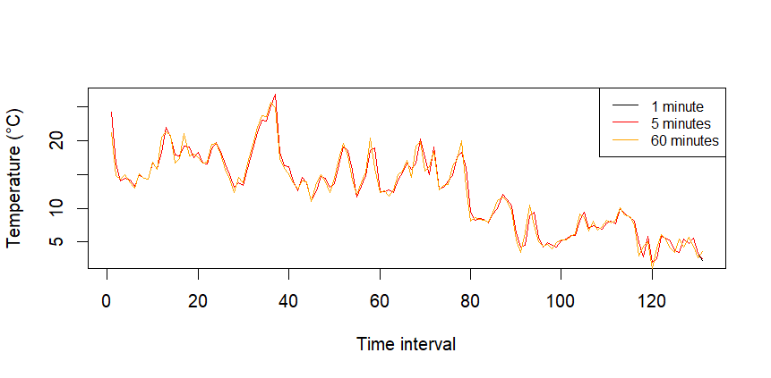
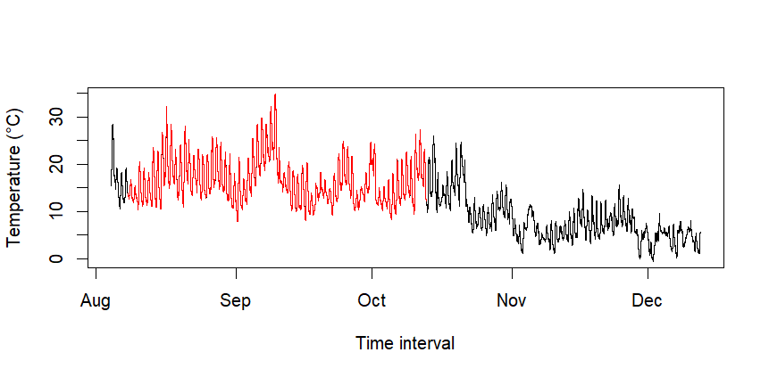
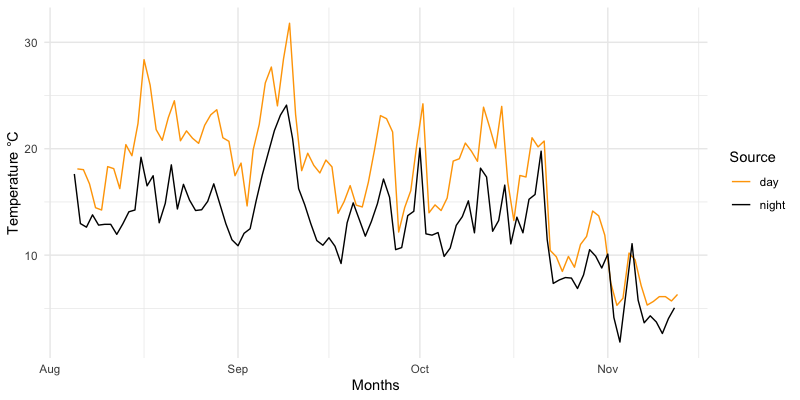
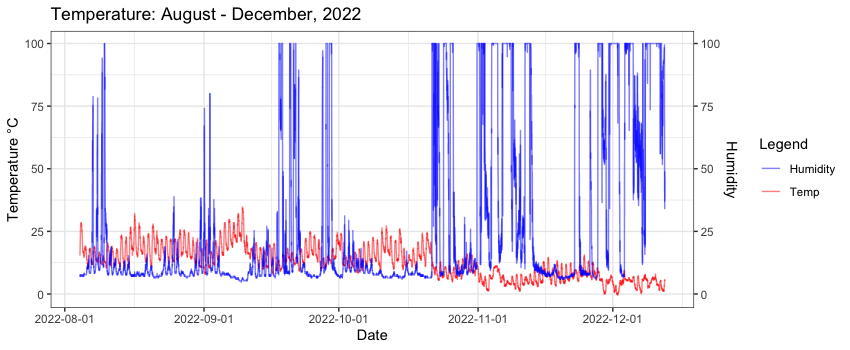

[](https://CRAN.R-project.org/package=hoboR)

# Welcome to **hoboR**: An R package for the analysis of HOBO weather data 
 
`hoboR` is a specialized R package designed to streamline the processing of large datasets from HOBO weather stations and data loggers. With `hoboR`, handling .csv files generated by various [HOBO](https://www.onsetcomp.com) models or other weather station data becomes effortless. This package analyzes microclimate measurements, including temperature, relative humidity (RH), dew point, and radiation. Additionally, `hoboR` is versatile in accepting data in multiple date formats, including *Day/Month/Year* (DD/MM/YYYY), *Month/Day/Year* (MM/DD/YYYY), and two digits *Year/Month/Day* (YY/MM/DD), ensuring flexibility across global time formats.

## HoboR Components and Other Examples

### [HOBOR components]({{ site.baseurl }}) 

### [HOBOR Callibration]({{ site.baseurl }}) 

### [An example to implement weather data]({{ site.baseurl }})

### Manuscript--> HOBOR: An R package for the analysis of HOBO weather data

# **Install hoboR**

`hoboR` installation via `devtools`, and in the process of submitting it to CRAN. 

First, install `devtools` and dependency libraries
```R
# Via CRAN
install.packages(hobor)

# or development tools

install.packages("devtools")
library("devtools")
 devtools::install_github("LeBoldus-Lab/hoboR", force = TRUE)
library(hoboR)

```
_Required dependencies_

```R
library(lubridate)
library(tidyr)
library(dplyr)
library(reshape2)
library(ggplot2)
library(scales)
```

## **"Why hoboR?"**

`hoboR` is a package for analyzing weather station data. Analyzing weather station data can quickly become a big data project, making processing and big data analysis a significant challenge. To facilitate the analysis and manipulation of weather station data. `hoboR` aims to simplify this process, making it less time-consuming for researchers and users of weather data. `hoboR` offers a series of tools to load multiple CSV files, remove duplicates, and process and summarize the data.

## **How to use hoboR**

### **For readers**
`hoboR` is an R package that processes CSV files from HOBO weather stations and data loggers. The best way to start your project with `hoboR` is to organize the downloaded CSV files from HOBO in a single directory. Using the `hobobinder()` function, all CSV files will be bound into a single data frame. For example, if you have 10 locations, you should have 10 folders, each containing all the CSVs. This group of weather records typically includes duplicate entries that `hobocleaner()` can handle and sort out. Most duplicates are generated by replacing batteries or retrieving data, etc. This clean data frame can be summarized by time and the sensors of the model device, like temperature, relative humidity, and precipitation, mean and standard deviation, or mins and max records by implementing `meanhobo()`. 

The HOBO sensors might fail due to environmental issues and other issues. To identify such mail functionality, a series of functions, including `identify impossiblevalues()` and `sensorfailures()`, is available. Additional functionality for subsetting by time intervals using `hoborange()`, and snapshots of time intervals using `timestamp()`. A calibration guide for HOBO data loggers used in microclimate experiments can be accessed and evaluated using the `calibrator()` and `correction()` functions to establish a baseline for all HOBO loggers, which is crucial for microclimate studies. A couple of customized functions are also available, including an example analysis of a buck bait experiment to investigate the incidence of sudden oak death (SOD) disease and environmental changes in Southern Oregon.

### **For coders**

```R
# load the library
library(hoboR)
```

## **Example:**
The data was collected in China Creek in Southern Oregon using a weather station. The measurements were recorded every minute over 5 months, from August to December 2022. The weather variables collected were humidity (Wetness), temperature (Temp), relative humidity (RH), and rain (Rain). 
```R
# Add the PATH to your sites for weather data (from HOBO)
path <- "../data/site_12_date_adj2" # example files 
# make sure the path to your CSV files exists
file.exists(path)     # this will return a logical value TRUE
```
Confirm that the path exists, then bind all CSV files and clean the data.

> After merging, all records are present, including duplicate entries. The `hobocleaner()` function cleans the duplicate entries and renames the columns. The format argument should match the HOBO format type: "ymd" for YYYY/MM/DD, "myd" for MM/YYYY/DD, and "yymd" corresponds to two-digit year YY/MM/DD. Be mindful of your format selection; otherwise, proceed with caution.

```R
# loading all hobo files, note to include how many lines to skip. Channels default is OFF. 
hobofiles <- hobinder(path, header = T, skip = 1, channels = "OFF")
# this function would clean duplicate entries
cleanfiles <- hobocleaner(hobofiles, format = "yymd")
head(hobocleaned)
```
Let's summarize the data every 30 min, and get the means for 1 day or get the mean every 24 hours

> Note: that the original data was recorded every minute.

```R
# get summary statistics
hobodata <- meanhobo(cleanfiles, summariseby = "5 mins", na.rm = T, minmax = T)
  hobodata

## Exercise to show the slight differences between aggregation times
#  getting hobo mean summary by time every 5 mins
hobot5 <- hobotime(cleanfiles, summariseby = "5 mins", na.rm = T)
hobomeans5 <- meanhobo(hobot5, summariseby = "24 h",  na.rm = T)
head(hobomeans5)

# getting hobo mean summary by time every 60 mins
hobot60 <- hobotime(cleanfiles, summariseby = "60 mins", na.rm = T)
hobomeans60 <- meanhobo(hobot60, summariseby = "24 h",  na.rm = T)
head(hobomeans60)

# getting hobo means by the original recording of 1 minute
hobot1 <- hobotime(cleanfiles, summariseby = "1 min", na.rm = T)
hobomeans1 <- meanhobo(hobot1, summariseby = "24 h",  na.rm = T)
head(hobomeans1)
```

> The clean data can be aggregated by time interval, e.g., `"5 mins"`, `"12 h"`, `"1 day"`, etc., the `hobotime()` function, or obtaining the mean, the minimum, and maximum, and other summary statistics by implementing `meanhobo()`.

Check the difference between both methods, summarizing and getting the mean, or mean only.

```R
# base plot figure
plot(1:nrow(hobomeans5), hobomeans5$x.Temp, type = "line", 
     xlab = "Time interval",
     ylab = "Temperature (°C)")
lines(1:nrow(hobomeans60), hobomeans60$x.Temp, type = "line", col = "red")
lines(1:nrow(hobomeans1), hobomeans1$x.Temp, type = "line", col = "orange")
legend("topright", legend = c("1 minute", "5 minutes", "60 minutes"),
       col = c("black", "red", "orange"), lty = 1, cex = 0.8)

```

 


If you want to select a time range, you can specify the date intervals using `hoborange`. Just specify the starting and end dates.

```R
# Specify a window range 
timerange <- hoborange(cleanfiles, start="2022-08-08", end="2022-10-12")
plot(cleanfiles$Date, cleanfiles$Temp, type = "s", col = "black",
     xlab = "Months",
     ylab = "Temperature (°C)")
lines(timerange$Date, timerange$Temp, type = "line", col = "red")
```

 


Check the variability every 12 hours, at midnight and noon for 100 days. 

```R
# Snapshot of a time interval 
a <- timestamp(cleanfiles, stamp = "2022-08-05 00:00", by = "24 hours",
               days = 100, na.rm = FALSE, plot = T , var = "Temp")
a$data$Group <- rep("night", nrow(a$data))
b <- timestamp(cleanfiles, stamp = "2022-08-05 12:01", by = "24 hours",
               days = 100, na.rm = FALSE, plot = T, var = "Temp")
b$data$Group <- rep("day", nrow(b$data))

daynight <- rbind(a$data, b$data)
```

Plot with `ggplot2` 

```R
library(ggplot2)
ggplot(daynight, aes(x = Date, y = Temp, group = Group, color = Group)) +
  geom_line() +
  scale_x_datetime() +
  scale_y_continuous(limits = c(0, 30)) +
  scale_color_manual(values = c("orange", "black")) +
  labs(color = "Source") +
  scale_y_continuous(name = "Temperature °C")+
  scale_x_datetime(name = "Months")+
  theme_minimal()
```

 

Fig. 1) Visualization of the summary results calculated with hoboR of the weather recorded between October 2021 and December 2021, in Brookings, Southern Oregon.

```R
# two vars
ggplot(hobocleaned, aes(x=as.POSIXct(Date))) +
  geom_line( aes(y=Temp, col = "red"), alpha = 0.5) + 
  geom_line( aes(y= Wetness, col = "blue"), alpha = 0.5) + 
  scale_y_continuous(
    # Features of the first axis
    name = "Temperature °C",
    # Add a second axis and specify its features
    sec.axis = sec_axis(~., name="Humidity")
  ) +
  labs(title = "Temperature: August - December, 2021", color = "Legend") +
  scale_color_manual(labels = c("Humidity", "Temp"), values = c("blue", "red")) +
  scale_x_datetime(name= "Date", labels = date_format("%Y-%m-%d"))+
  theme_bw()
```

 

Fig. 2) Visualization of the summary statistics of two weather variables (temperature and humidity) in Southern Oregon from October to December 2021.

Thank you for exploring the hoboR package. This tool is designed to facilitate statistical analyses and visualizations for ecology research. We will continue improving hoboR, incorporating new findings and feedback from the community to enhance its utility and functionality.

Acknowledgements:
**Work funded by the National Science Foundation (NSF) and the United States Department of Agriculture (USDA).**

Further Support
For further support or to contribute to the project, please visit our [GitHub repository](https://github.com/LeBoldus-Lab/hoboR).

> Note: This package is an independent open-source tool for working with HOBO weather station data and is not affiliated with or endorsed by the manufacturer.


