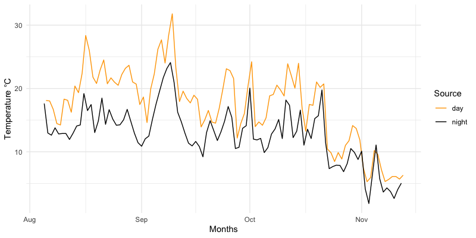

# Summary

Meteorological records captured by weather stations and data loggers can accumulate large amounts of digital information. Local and regional efforts to create weather station networks, as well as projects oriented to the study of microclimates and smart agriculture, have increased the use of weather stations `[@:Estevez2011; @Lembrechts2021; @Hachimi2023]`. These large and complex datasets can be difficult to analyze for non-expert users. HOBO (ONSET, United Kingdom) data loggers are among the most popular weather stations because they are relatively inexpensive and easy to use. A HOBO graphic user interface exists but is not easy to export to statistical data analysis languages. As a result, we developed the hoboR, an R package to read, combine, and manipulate CSV files. These algorithms support the removal of redundant data, create meteorological summaries by time and date, support the identification of sensor failures and out-of-range values, and the calculation of summary statistics (i.e., max, min, mean, and standard deviation).

# Statement of need

HoboR is an R package `[@R2024]` for efficiently processing large datasets, automating these tasks by loading the CSV files into a data frame structure specific to HOBO dataloggers, significantly reducing the time and effort required for data handling and management, and increasing the accuracy and reproducibility of the analysis. HoboR functions remove duplicate entries, summarize the data by time intervals (minutes, hours, and/or days), and subset files by user-determined ranges. The package can also identify and address common data quality and accuracy issues related to sensor failures, out-of-range entries, time zone discrepancies, and data formats. 

Developing software to automate data processing collected by weather stations and data loggers can facilitate the analysis of local weather and microclimate patterns. Typically, this data is used to correlate meteorological measurements with weather depending on biological processes, species compositions, and a variety of agricultural applications `[@Hachimi2023; @Dahl2023; @Nikolaou2023; @Wu2023]`. Traditional spreadsheet interfaces pose an inherent challenge when handling data from large and complex studies, making managing and curating these datasets time-consuming and error-prone. In many cases, the large file sizes make spreadsheet-based interfaces unable to handle an entire dataset and/or very difficult to remove redundant data. The integration of advanced algorithms and user-friendly software makes hoboR accessible to researchers and programmers with differing levels of experience, facilitating the implementation of the analysis of meteorological data to ecology, agriculture, and other meteorological science, improving data wrangling. Other packages to analyze weather data exist in Turbo Pascal `[@Pickering1994]`, and R packages have been developed to analyze weather data captured by satellites, including NASA Power and rnoa `[@Sparks2018; @Chamberlain2023]`. To our knowledge, no R package is available for collecting and analyzing large meteorological data sets collected from HOBO weather stations.

Weather station data can be logged at various time intervals for different types of sensors, including rain gauges, temperature, relative humidity (RH), leaf wetness, and solar radiation, among others.  The main functions of hoboR implement dynamic interpretation programming, which enables the processing of independent spreadsheets with any number of sensors given by the HOBO weather station or data logger, allowing the data to be arranged into an initial column structure. The package output includes the summary statistics of the minimum, maximum, mean, and standard deviation values and can be rounded to the nearest interval, such as minute, hour, or day. Other functions were developed to help summarize the data by time intervals and different ranges of dates. Among the challenges in recording meteorological data are the various errors that occur during data collection. These errors could include damage to the logger, debris blocking the sensors, battery replacement, and malfunctioning sensors or loggers. These issues can result in multiple entries that might be challenging and time-consuming to detect, correct, and curate in tabular format. HoboR functions can help identify and replace these unrealistic values. In addition, we provide a framework to calibrate and correct the variation among data loggers, which is important for studying microclimates. A schematic representation of the processing pipeline is illustrated in Fig. 1.\autoref{fig:flowchart}.


![A workflow for the hoboR package, describing the recommended steps for effective data analysis using HOBO weather stations and data loggers. The process is initiated by aggregating CSV files from a directory corresponding to each location, followed by summarizing duplicate entries and parsing the data chronologically. Subsequent steps include direct analysis of the data or further manipulation of the data by time and range, complemented by a pre-processing stage for quality assessment to detect impossible values. Optional calibration steps are also illustrated to enhance data accuracy. Solid lines indicate the standard workflow for HOBO data analysis, while discontinuous lines represent the optional calibration process.](flowchart.png){ width=80% }


# Example
The following example cleans and summarizes the test dataset collected in Brookings, Oregon, between August and December 2021 (Fig. 2)\autoref{fig:hobo-daynight} as part of the Carson (2022) thesis at the Botany and Plant Pathology Department at Oregon State University. We tested the package using partial datasets from different weather stations and data loggers. Carson’s (2022) full dataset consists of millions of entries. The code is reproduced below.

```R
# load the library
library(hoboR)
# Analysis
# Add the PATH to your sites for weather data (from HOBO)
path = paste0("~/site_12_date_adj2/")
# make sure the path to your CSV files exists
file.exists(path)     # this will return a logical value TRUE
# loading all hobo files
hobofiles <- hobinder(path, skip = 1)
hobocleaned <- hobocleaner(hobofiles, format = "yymd")
head(hobocleaned)
# getting hobo mean summary by time
hobot5 <- hobotime(hobocleaned, summariseby = "30 mins", na.rm = T)
hobomeans5 <- meanhobo(hobot5, summariseby = "1 day",  na.rm = T)
head(hobomeans5)

# getting hobo means by date
hobomeans <- meanhobo(hobocleaned, summariseby = "24 h",  na.rm = T)
head(hobomeans)
# Specify a window range 
timerange <- hoborange(hobocleaned, start="2022-08-08", end="2022-12-12")
head(timerange)
# Snapshot of a time interval 
a <- timestamp(hobocleaned, stamp = "2022-08-05 00:01", by = "24 hours",
               days = 100, na.rm = FALSE, plot = F, var = "Temp")
a$Group <- rep("night", nrow(a))
b <- timestamp(hobocleaned, stamp = "2022-08-05 12:01", by = "24 hours",
               days = 100, na.rm = FALSE, plot = F, var = "Temp")
b$Group <- rep("day", nrow(b))

daynight <- rbind(a, b)
ggplot(daynight, aes(x = Date, y = Temp, group = Group, color = Group)) +
  geom_line() +
  scale_x_datetime() +
  scale_y_continuous(limits = c(0, 30)) +
  scale_color_manual(values = c("orange", "black")) +
  labs(color = "Source") +
  scale_y_continuous(name = "Temperature °C")+
  scale_x_datetime(name = "Months")+
  theme_minimal()

```


{ width=80% }

This package requires R version 4.3.0 or later. It also requires the following packages:
data.table, dplyr, ggplot2, lubridate, plyr. These dependencies should be installed automatically when dependencies = TRUE is set in the command used to install the
package.

```R
> if (!require("devtools")) \\
> install.packages("devtools")\\
> devtools::install_github("leboldus_lab/hoboR", dependencies = TRUE)
```

# Authors contribution
Ricardo I. Alcalá Briseño developed and maintained the package, wrote the documentation, debugged the code, and wrote the manuscript. Adam R. Carson collected the data, wrote code implemented in the package, and debugged the code. Sky Lan collected the data, wrote code implemented in the package, and assisted in the user-functionality of the code functions. Ebba Peterson assisted in best practices for post-processing weather stations and data loggers. Niklaus J. Grunwald participated in manuscript preparation and funding. Jared M. LeBoldus supervised the project, manuscript preparation, and funding.


# Citations


# Acknowledgements

United States Department of Agriculture Cooperative agreement number: 58-2072-1-039. The financial support was not involved in developing this program.

# Disclosure

None of the author's declare any conflict of interest.
